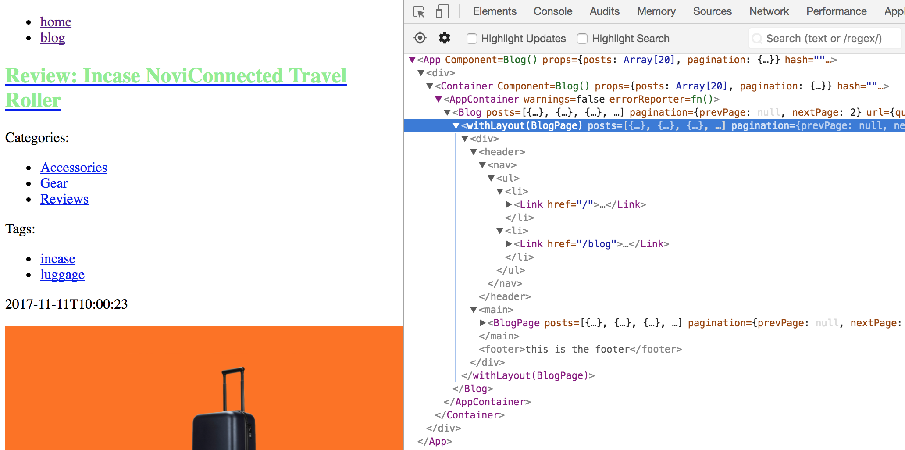
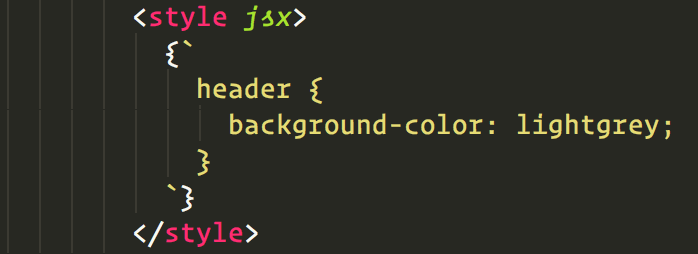
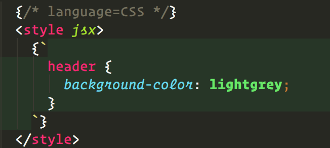

# Let's make a WordPress-based blog with React and NodeJS

In this workshop, we are going to make a blog. To manage the content of our blog, we will be using
WordPress, one of the leading content management systems today. However, contrary to most WordPress
blogs in existence today, we will not be using PHP to create the theme for our blog. Instead, we are
going to manage the front-end with a variety of modern web technologies: JavaScript, React, and some
NodeJS.

## Why choose this tech stack? :question:
It's important to note that this way of doing things is not for everyone. As always, our
technology choices will have some upsides and some downsides. In the case of choosing React, here
are, in no particular order, a few pros and cons:

* :fire: Pros:
    * Extremely rapid feedback during the development cycle
    * The resulting single-page application can have faster loading times and navigation
    * Great ability and ease to add interactive features like infinite scrolling
    * Ability to get going without having to learn PHP
    * Even greater separation between back-end and front-end
    * Ease of managing different development environments without copying WordPress data
* :poop: Cons:
    * Some complexity will be introduced by having two different technologies – PHP and JavaScript
    * Having a build process for the front-end complicates things
    * The need to have two hosting environments, one for WordPress and one for our “theme”
    * The reduced number of people who can help us due to our non-conventional setup

Now that that's out of the way, let's not come back to it and concentrate on the task at hand.

<p align="center">
   
</p>

---

## Technical requirements :computer:


In order to successfully complete this workshop, you will need:

* A computer with an internet connection
* The software mentioned in the [next section](#required-software)
* Some familiarity with modern JavaScript, React and NodeJS
* Some familiarity with the command line interface of your machine
* Familiarity with Git is optional, but you should use it to track your progress!

---

## Thanks :two_hearts:
Before moving forward with the workshop, I'd like to express my thanks to the people who
helped make this possible:

- [Nathaniel Kitzke](https://github.com/nk1tz): for TAing and fixing a thousand typos
- [Timothy Mulqueen](https://github.com/multimo): for TAing and fixing some glaring mistakes
- [Paule Lepage](https://github.com/nyanofthemoon): for TAing and moral support

<p align="center">
   
</p>

---

## Getting started! :rocket:

### Required software
To follow along successfully, you will need to install some software on your machine:

* [Install NVM](https://github.com/creationix/nvm)

  NVM is “Node Version Manager”. Through it, we can install any version of NodeJS. For this
  workshop, we will be using **NodeJS 8.9.0**. Once NVM is installed, you can run the following
  command to install NodeJS:
  
  ```sh
  nvm install 8.9.0
  nvm alias default 8.9.0
  ```
  
  After running these commands, you might need to open a new shell for them to take effect.

* [Install a recent version of Yarn](https://yarnpkg.com/lang/en/docs/install/)
  
  Yarn is a package manager for JavaScript code. It will allow us to install external libraries
  easily. Yarn will also allow us to execute our code with simple command lines.

* [Install the WebStorm IDE](https://www.jetbrains.com/webstorm/)

  Many IDEs exist that support JavaScript. WebStorm is a phenomenal IDE that comes batteries
  included. Once installed, you will not need any special configurations nor plugins. It will work
  out of the box.
  
  **NOTE**: It is fine to use the IDE of your choice, but WebStorm is *recommended*. It will ensure
  that you have the same setup as your workshop-mates and make it easier for the TAs.

* [Install Google Chrome](https://www.google.com/chrome/index.html)

  You can use the browser of your choice to follow this workshop, but Chrome is recommended. This
  will ensure that you have the same setup as your workshop-mates and make it easier for the TAs.
  
* Install React Developer Tools

  Available for [Chrome](https://chrome.google.com/webstore/detail/react-developer-tools/fmkadmapgofadopljbjfkapdkoienihi?hl=en)
  and [Firefox](https://addons.mozilla.org/en-US/firefox/addon/react-devtools/), React Developer
  Tools is a browser extension that allows you to introspect your running React application, making
  it easier to debug.

* **What about WordPress??** :question:

  You will not need to install a WordPress instance in order to complete the workshop. If you
  already have your WordPress blog with WP-API, you will simply be able to use it. If you do not
  have a readily-available WordPress blog, you will be able to use [wired.com](https://wired.com)'s
  WP-API.
  
  One of the great things about the setup we will have is that you will easily be able to change
  which WordPress blog it is associated to by simply changing one line in your JavaScript code.
  
<p align="center">
   
</p>

### Initial setup
Now that you have installed all the necessary software on your machine, you are ready to start! In
this section, you will be initializing your development environment, creating the base code, and
making your first web page with this setup.

Start by creating an empty directory on your machine. Then, move to that directory and run the
following commands:

```sh
yarn init # You can edit your answers to the prompts later
yarn add react react-dom next
```

Based on the requirements of this workshop, this should all be familiar to you except perhaps for
the `next` framework. [Next.js](https://github.com/zeit/next.js/) is the framework that will allow
us to run the same React application on both the server (Express) and the client (browser). This is
what will allow us to develop our blog with modern front-end technologies without having to forego
the benefits of an initial server rendering – SEO and faster loading.

Once this is done, open WebStorm and create a new project based on the directory you just setup.
Then, open the `package.json` file and add the following section at the root:

```
  "scripts": {
    "start": "next"
  }
```

Then, create a directory called `pages` at the root of your project. In it, create a file called
`index.js` with the following code:

```js
import React from 'react';

const HomePage = () => (
  <div>
    <h1>Welcome to my blog</h1>
  </div>
);

export default HomePage;
```

Once this is done, you will have created a basic Next.js setup. Go back to your command line and
run:

```sh
yarn start
```

After a few seconds, your app should be started. Open your browser and navigate to `localhost:3000`
to see your new creation. If you “view source”, you will notice that the server sent the content of
your React component along with the response. If you open your React Developer Tools, you will see
that the React application is running in the browser. Two environments, one code! :fire:

This concludes the initial setup of the workshop. Let's seal the deal by
creating a Git repository and committing all this goodness.

To prevent Git from tracking undesirable artifact files, create a `.gitignore` file at the root of
your project with the following lines:

```
.next
node_modules
```

Then, run `git init`, `git add .` and `git commit` to seal your work inside the repository.

:warning: **NOTE**: from now on, the workshop instructions will not mention Git anymore. It's up to
you if you want to use it to have a clean commit for each step of the workshop. If you do, it will
allow you to look at the history of your code and afford you all the benefits Git has to offer. 

<p align="center">
   
</p>

---

## Adding another page and linking to it :link:
Next.js makes it easy to add new pages to your application. All you have to do is create a new file
under the `pages` directory. The name of the file will be the same as the URL path to access it.
While this seems limiting – how do we do pretty URLs?? – we will see in a later section that this
can be fixed by using Next.js' powerful request handler.

Create a new file called `blog.js` in the `pages` directory. In there, follow the same pattern as
`index.js` to create a page that simply says “Recent blog posts”. In the next section, we will use
this page to call the WordPress API and create a blog listing.

Then, re-open `pages/index.js` and make the following changes:

```js
// Add this line at the top of the file
import Link from 'next/link';

// Add this line inside the <div>, below the <h1>
<Link href="/blog"><a>Go to the recent posts</a></Link>
```

Then, go back to your browser. Did you notice that the changes appear right away, without having to
reload the page? This is one of the many benefits of using this tech stack, and with Next.js you get
it for free. If you click on the link, you should navigate to the `/blog` page. Using your favorite
technique, convince yourself that this navigation has happened without a full page reload.

### Why not simply use an `<a>` for navigation?
If you look at the source code of the `/` page, you will see that the server has rendered an `<a>`
in place of the `<Link>`. This is great for SEO purposes. However, using the `<Link>` component
makes this link dynamic. In the browser, Next.js prevents the default action and handles navigation
using the History API. This gives you the best of both worlds: SEO and :fire: fast navigation.

:warning: **NOTE**: It might look weird to have an `<a>` *inside* the `<Link>` but this is how Next
wants you to do it.

<p align="center">
   
</p>

---

## First contact: using the WordPress API! :alien:
In this section, we will use the WordPress API to show a list of recent posts on the `/blog` page.
The WordPress API is based on the [application/hal+json](http://stateless.co/hal_specification.html).
This will make it easy for us to grab not only post data, but all sorts of related data like tags,
categories, and author info. This data is provided through the use of
[hyperlinks](https://developer.wordpress.org/rest-api/using-the-rest-api/linking-and-embedding/),
but the WordPress API allows us to embed those links in order to avoid multiple HTTP requests.

The **TL;DR** of this is that WordPress API will include HTTP links to related resources, but adding
`?_embed` at the end of a WordPress API URL will automatically embed all the linked resources. Here
is an example of requesting a single blog post without `_embed`:

```json
{
    "id": 2267743,
    "date": "2017-11-11T10:00:23",
    "date_gmt": "2017-11-11T15:00:23",
    "guid": {
        "rendered": "https://www.wired.com/?p=2267743"
    },
    "modified": "2017-11-10T18:37:44",
    "modified_gmt": "2017-11-10T23:37:44",
    "slug": "review-incase-noviconnected-travel-roller",
    "type": "post",
    "link": "https://www.wired.com/2017/11/review-incase-noviconnected-travel-roller/",
    "title": {
        "rendered": "Review: Incase NoviConnected Travel Roller"
    },
    "content": {
        "rendered": "<p>If you’re the kind of person who will arrive at the airport without charging your phone or laptop, you are also the kind of person who will forget to charge the battery bank in your smart luggage. I discovered this when a three-hour delay kicked off my weekend trip with Incase’s NoviConnected carry-on suitcase. Sorry, but it’s true.</p>\n<p>At home, it took six hours of wall charging at home to get the NoviConnected’s 10,050-mAh battery up to 100%. A few days later, I packed my bag, headed to the airport and waited at the gate. By the time I realized I needed to charge my phone, the suitcase’s battery had gone down to 76% after doing nothing, with an estimated one hour and 23 minutes’ worth of juice. </p>\n<p>Charging my phone back up to 80% took the suitcase’s battery down to 19%. What about charging a laptop? Forget about it. The bag’s battery bank is strictly for small devices only and it&#8217;s best conserved for an emergency situation. Since everything from your boarding pass to your hotel reservation is on your phone, you&#8217;ll need that to be juiced up, so it&#8217;s not a total loss. Like the rest of the bag’s smart features, it may promise more than it can actually deliver.</p>\n<p>For example, take the suitcase’s Smart Luggage tracker. It uses Bluetooth and has a range of up to 33 feet. On a full flight, I ended up checking my carry-on at the airline’s request. When I got to baggage claim, I glanced at the Incase app to determine my luggage’s whereabouts and found out that my bag was out of range. For fifteen minutes, I waited at the baggage carousel like an ordinary plebe, trapped in a seemingly endless purgatory, mired in deep existential uncertainty. </p>\n<p>Even walking across my house prompted a notification from my phone, alerting me that the suitcase&#8212;safely in my office&#8212;was no longer within range. If you want a smart luggage tracker, it should probably use GPS instead of Bluetooth.</p>\n\n<div id=\"wired-tired\" class=\"carve col sm-col-18 med-col-9 big-col-9 fader proxima gray-5 relative\" data-share data-js=\"fader\">\n\t\t\t\t\t<div id=\"wired-tired-text\" class=\"pad-t-med\">\n\t\t<h2 class=\"tungsten no-marg\">Incase NoviConnected Travel Roller</h2>\n\t\t<h3 class=\"tungsten gray-5 no-marg\">5/10</h3>\t\t<div class=\"border-box border-t hide-mob hide-sm hide-med\">\n\t\t\t<a class=\"byline gray-5 no-underline no-hover\" href=\"#\" data-ui=\"howRateOpen\">Learn How We Rate</a>\n\t\t</div>\n\t\t<h5 class=\"brandon uppercase border-t\">Wired</h5>\n\t\t<p class=\"gray-5\">Beautiful. Durable. Hubless wheels roll smoothly and easily and are easily replaceable. Battery bank will save you in a pinch. Comes with rain cover.</p>\n\t\t<h5 class=\"brandon uppercase border-t\">Tired</h5>\n\t\t<p class=\"gray-5\">Bluetooth tracker makes no sense. No side handle. Battery life was disappointing.</p>\n\t\t<div class=\"border-box border-t border-b gray-5\">\n\t\t\t\t\t\t\t\t<a class=\"byline float-l no-underline no-hover\" rel=\"nofollow\" href=\"https://www.amazon.com/dp/B076B6LW8T/?tag=w050b-20\" target=\"_blank\">Buy It Now</a>\n\t\t\t<span class=\"byline gray-5\">&nbsp;&nbsp;|&nbsp;&nbsp;Incase</span>\n\t\t\t\t\t\t\t</div>\n\t</div>\n\n\t<div id=\"how-rate\" class=\"hide hide-mob hide-sm hide-med bg-white absolute bottom left right\" data-js='howWeRate'>\n\t\t<a data-ui=\"howRateClose\" class=\"float-r no-underline no-hover marg-t-med\">\n\t\t\t<i aria-hidden=\"true\" role=\"presentation\" class=\"ui ui-close opacity-3 r-align\"></i>\n\t\t</a>\n\t\t<h4 class=\"tungsten clamp-6 pad-t-med pad-b-med clearfix\">How We Rate</h4>\n\t\t<div class=\"border-box border-t border-b pad-t-med pad-b-med\">\n\t\t\t<ul class=\"score-key list-none no-marg\">\n\t\t\t\t<li class=\"no-marg\">\n\t\t\t\t\t<span class=\"tungsten marg-r-micro inline-block v-align-b score\">1/10</span>A complete failure in every way\n\t\t\t\t</li>\n\t\t\t\t<li class=\"no-marg\">\n\t\t\t\t\t<span class=\"tungsten marg-r-micro inline-block v-align-b score\">2/10</span>Sad, really\n\t\t\t\t</li>\n\t\t\t\t<li class=\"no-marg\">\n\t\t\t\t\t<span class=\"tungsten marg-r-micro inline-block v-align-b score\">3/10</span>Serious flaws; proceed with caution\n\t\t\t\t</li>\n\t\t\t\t<li class=\"no-marg\">\n\t\t\t\t\t<span class=\"tungsten marg-r-micro inline-block v-align-b score\">4/10</span>Downsides outweigh upsides\n\t\t\t\t</li>\n\t\t\t\t<li class=\"no-marg\">\n\t\t\t\t\t<span class=\"tungsten marg-r-micro inline-block v-align-b score\">5/10</span>Recommended with reservations\n\t\t\t\t</li>\n\t\t\t\t<li class=\"no-marg\">\n\t\t\t\t\t<span class=\"tungsten marg-r-micro inline-block v-align-b score\">6/10</span>Solid with some issues\n\t\t\t\t</li>\n\t\t\t\t<li class=\"no-marg\">\n\t\t\t\t\t<span class=\"tungsten marg-r-micro inline-block v-align-b score\">7/10</span>Very good, but not quite great\n\t\t\t\t</li>\n\t\t\t\t<li class=\"no-marg\">\n\t\t\t\t\t<span class=\"tungsten marg-r-micro inline-block v-align-b score\">8/10</span>Excellent, with room to kvetch\n\t\t\t\t</li>\n\t\t\t\t<li class=\"no-marg\">\n\t\t\t\t\t<span class=\"tungsten marg-r-micro inline-block v-align-b score\">9/10</span>Nearly flawless\n\t\t\t\t</li>\n\t\t\t\t<li class=\"no-marg\">\n\t\t\t\t\t<span class=\"tungsten marg-r-micro inline-block v-align-b score\">10/10</span>Metaphysical perfection\n\t\t\t\t</li>\n\t\t\t</ul>\n\t\t</div>\n\t</div>\n</div>\n\n<p>But as a piece of ordinary luggage, the bag performed admirably. It has a simple, durable makrolon polycarbonate shell that showed little wear after a few trips around the baggage carousel. The navy color of my sample case was elegant and surprisingly distinctive among a billion black bags. The interior, with mesh zip pockets and an included laundry bag, easily accommodated several days’ worth of clothes and shoes. </p>\n<p>The bag was impossible to tip over, even with a tote bag hooked on top. The hubless wheels rolled smoothly—almost a little too smoothly, as the suitcase escaped me when my attention wandered on a slanting parking lot garage floor—and it’s simple to pop the wheels on and off if you need to fit the suitcase into an overhead compartment. This model also carries a lifetime warranty from Incase, so the wheels are covered if they break (the power bank&#8217;s embedded battery has a two-year limited warranty). </p>\n<p>The integrated TSA-approved lock works like you&#8217;d expect, and it proved useful when I ended up checking my carry-on to save overhead space on two packed flights. However, I would have appreciated a side handle to make it easier to hoist around. </p>\n<p>As holiday travel season approaches, you do have to find a way to get all your stuff from Point A to Point B without carrying it all in your arms. Incase is known for their attractive, Apple-compatible accessories and bags, and the NoviConnected is no exception. It’s elegant, rolls with ease, and has the capacity to save your tuchus right when you need it most—when your phone is about to die and you have no way to text your ride or check your car rental confirmation number.</p>\n<p>But there are just too many other moderately-priced smart carry-ons out there right now with features that make a bit more sense, like a true GPS locator that can tell you if your baggage has made it to your destination. Or just bring your own <a rel=\"nofollow\" href=\"https://www.amazon.com/dp/B0194WDVHI/?tag=w050b-20\" target=\"_blank\">spare battery</a> and pop a <a rel=\"nofollow\" href=\"https://www.amazon.com/dp/B01MF9VQOP/?tag=w050b-20\" target=\"_blank\">Tile tracker</a> into your current luggage and call it a day.</p>\n"
    },
    "excerpt": {
        "rendered": "<p>A great piece of luggage is brought down by its poor smart features.</p>\n"
    },
    "author": 609,
    "featured_media": 2267773,
    "comment_status": "open",
    "ping_status": "closed",
    "sticky": false,
    "format": "standard",
    "categories": [
        36,
        83082,
        4
    ],
    "tags": [
        106059,
        106060
    ],
    "series": [],
    "admin-settings": [],
    "_links": {
        "self": [
            {
                "href": "https://www.wired.com/wp-json/wp/v2/posts/2267743"
            }
        ],
        "collection": [
            {
                "href": "https://www.wired.com/wp-json/wp/v2/posts"
            }
        ],
        "about": [
            {
                "href": "https://www.wired.com/wp-json/wp/v2/types/post"
            }
        ],
        "author": [
            {
                "embeddable": true,
                "href": "https://www.wired.com/wp-json/wp/v2/users/609"
            }
        ],
        "replies": [
            {
                "embeddable": true,
                "href": "https://www.wired.com/wp-json/wp/v2/comments?post=2267743"
            }
        ],
        "version-history": [
            {
                "href": "https://www.wired.com/wp-json/wp/v2/posts/2267743/revisions"
            }
        ],
        "wp:featuredmedia": [
            {
                "embeddable": true,
                "href": "https://www.wired.com/wp-json/wp/v2/media/2267773"
            }
        ],
        "wp:attachment": [
            {
                "href": "https://www.wired.com/wp-json/wp/v2/media?parent=2267743"
            }
        ],
        "wp:term": [
            {
                "taxonomy": "category",
                "embeddable": true,
                "href": "https://www.wired.com/wp-json/wp/v2/categories?post=2267743"
            },
            {
                "taxonomy": "post_tag",
                "embeddable": true,
                "href": "https://www.wired.com/wp-json/wp/v2/tags?post=2267743"
            },
            {
                "taxonomy": "series",
                "embeddable": true,
                "href": "https://www.wired.com/wp-json/wp/v2/series?post=2267743"
            },
            {
                "taxonomy": "admin-settings",
                "embeddable": true,
                "href": "https://www.wired.com/wp-json/wp/v2/admin-settings?post=2267743"
            }
        ],
        "curies": [
            {
                "name": "wp",
                "href": "https://api.w.org/{rel}",
                "templated": true
            }
        ]
    }
}
```

<p align="center">
   
   <br>
   Get it? JASON 🤣
</p>

Notice that fields like author, categories, and tags appear as numbers, IDs of their respective
types. The `_links` section contains HTTP links to those resources. Here is the same request with
`_embed` added at the end of the URL:

```json
{
    "id": 2267743,
    "date": "2017-11-11T10:00:23",
    "date_gmt": "2017-11-11T15:00:23",
    "guid": {
        "rendered": "https://www.wired.com/?p=2267743"
    },
    "modified": "2017-11-10T18:37:44",
    "modified_gmt": "2017-11-10T23:37:44",
    "slug": "review-incase-noviconnected-travel-roller",
    "type": "post",
    "link": "https://www.wired.com/2017/11/review-incase-noviconnected-travel-roller/",
    "title": {
        "rendered": "Review: Incase NoviConnected Travel Roller"
    },
    "content": {
        "rendered": "<p>If you’re the kind of person who will arrive at the airport without charging your phone or laptop, you are also the kind of person who will forget to charge the battery bank in your smart luggage. I discovered this when a three-hour delay kicked off my weekend trip with Incase’s NoviConnected carry-on suitcase. Sorry, but it’s true.</p>\n<p>At home, it took six hours of wall charging at home to get the NoviConnected’s 10,050-mAh battery up to 100%. A few days later, I packed my bag, headed to the airport and waited at the gate. By the time I realized I needed to charge my phone, the suitcase’s battery had gone down to 76% after doing nothing, with an estimated one hour and 23 minutes’ worth of juice. </p>\n<p>Charging my phone back up to 80% took the suitcase’s battery down to 19%. What about charging a laptop? Forget about it. The bag’s battery bank is strictly for small devices only and it&#8217;s best conserved for an emergency situation. Since everything from your boarding pass to your hotel reservation is on your phone, you&#8217;ll need that to be juiced up, so it&#8217;s not a total loss. Like the rest of the bag’s smart features, it may promise more than it can actually deliver.</p>\n<p>For example, take the suitcase’s Smart Luggage tracker. It uses Bluetooth and has a range of up to 33 feet. On a full flight, I ended up checking my carry-on at the airline’s request. When I got to baggage claim, I glanced at the Incase app to determine my luggage’s whereabouts and found out that my bag was out of range. For fifteen minutes, I waited at the baggage carousel like an ordinary plebe, trapped in a seemingly endless purgatory, mired in deep existential uncertainty. </p>\n<p>Even walking across my house prompted a notification from my phone, alerting me that the suitcase&#8212;safely in my office&#8212;was no longer within range. If you want a smart luggage tracker, it should probably use GPS instead of Bluetooth.</p>\n\n<div id=\"wired-tired\" class=\"carve col sm-col-18 med-col-9 big-col-9 fader proxima gray-5 relative\" data-share data-js=\"fader\">\n\t\t\t\t\t<div id=\"wired-tired-text\" class=\"pad-t-med\">\n\t\t<h2 class=\"tungsten no-marg\">Incase NoviConnected Travel Roller</h2>\n\t\t<h3 class=\"tungsten gray-5 no-marg\">5/10</h3>\t\t<div class=\"border-box border-t hide-mob hide-sm hide-med\">\n\t\t\t<a class=\"byline gray-5 no-underline no-hover\" href=\"#\" data-ui=\"howRateOpen\">Learn How We Rate</a>\n\t\t</div>\n\t\t<h5 class=\"brandon uppercase border-t\">Wired</h5>\n\t\t<p class=\"gray-5\">Beautiful. Durable. Hubless wheels roll smoothly and easily and are easily replaceable. Battery bank will save you in a pinch. Comes with rain cover.</p>\n\t\t<h5 class=\"brandon uppercase border-t\">Tired</h5>\n\t\t<p class=\"gray-5\">Bluetooth tracker makes no sense. No side handle. Battery life was disappointing.</p>\n\t\t<div class=\"border-box border-t border-b gray-5\">\n\t\t\t\t\t\t\t\t<a class=\"byline float-l no-underline no-hover\" rel=\"nofollow\" href=\"https://www.amazon.com/dp/B076B6LW8T/?tag=w050b-20\" target=\"_blank\">Buy It Now</a>\n\t\t\t<span class=\"byline gray-5\">&nbsp;&nbsp;|&nbsp;&nbsp;Incase</span>\n\t\t\t\t\t\t\t</div>\n\t</div>\n\n\t<div id=\"how-rate\" class=\"hide hide-mob hide-sm hide-med bg-white absolute bottom left right\" data-js='howWeRate'>\n\t\t<a data-ui=\"howRateClose\" class=\"float-r no-underline no-hover marg-t-med\">\n\t\t\t<i aria-hidden=\"true\" role=\"presentation\" class=\"ui ui-close opacity-3 r-align\"></i>\n\t\t</a>\n\t\t<h4 class=\"tungsten clamp-6 pad-t-med pad-b-med clearfix\">How We Rate</h4>\n\t\t<div class=\"border-box border-t border-b pad-t-med pad-b-med\">\n\t\t\t<ul class=\"score-key list-none no-marg\">\n\t\t\t\t<li class=\"no-marg\">\n\t\t\t\t\t<span class=\"tungsten marg-r-micro inline-block v-align-b score\">1/10</span>A complete failure in every way\n\t\t\t\t</li>\n\t\t\t\t<li class=\"no-marg\">\n\t\t\t\t\t<span class=\"tungsten marg-r-micro inline-block v-align-b score\">2/10</span>Sad, really\n\t\t\t\t</li>\n\t\t\t\t<li class=\"no-marg\">\n\t\t\t\t\t<span class=\"tungsten marg-r-micro inline-block v-align-b score\">3/10</span>Serious flaws; proceed with caution\n\t\t\t\t</li>\n\t\t\t\t<li class=\"no-marg\">\n\t\t\t\t\t<span class=\"tungsten marg-r-micro inline-block v-align-b score\">4/10</span>Downsides outweigh upsides\n\t\t\t\t</li>\n\t\t\t\t<li class=\"no-marg\">\n\t\t\t\t\t<span class=\"tungsten marg-r-micro inline-block v-align-b score\">5/10</span>Recommended with reservations\n\t\t\t\t</li>\n\t\t\t\t<li class=\"no-marg\">\n\t\t\t\t\t<span class=\"tungsten marg-r-micro inline-block v-align-b score\">6/10</span>Solid with some issues\n\t\t\t\t</li>\n\t\t\t\t<li class=\"no-marg\">\n\t\t\t\t\t<span class=\"tungsten marg-r-micro inline-block v-align-b score\">7/10</span>Very good, but not quite great\n\t\t\t\t</li>\n\t\t\t\t<li class=\"no-marg\">\n\t\t\t\t\t<span class=\"tungsten marg-r-micro inline-block v-align-b score\">8/10</span>Excellent, with room to kvetch\n\t\t\t\t</li>\n\t\t\t\t<li class=\"no-marg\">\n\t\t\t\t\t<span class=\"tungsten marg-r-micro inline-block v-align-b score\">9/10</span>Nearly flawless\n\t\t\t\t</li>\n\t\t\t\t<li class=\"no-marg\">\n\t\t\t\t\t<span class=\"tungsten marg-r-micro inline-block v-align-b score\">10/10</span>Metaphysical perfection\n\t\t\t\t</li>\n\t\t\t</ul>\n\t\t</div>\n\t</div>\n</div>\n\n<p>But as a piece of ordinary luggage, the bag performed admirably. It has a simple, durable makrolon polycarbonate shell that showed little wear after a few trips around the baggage carousel. The navy color of my sample case was elegant and surprisingly distinctive among a billion black bags. The interior, with mesh zip pockets and an included laundry bag, easily accommodated several days’ worth of clothes and shoes. </p>\n<p>The bag was impossible to tip over, even with a tote bag hooked on top. The hubless wheels rolled smoothly—almost a little too smoothly, as the suitcase escaped me when my attention wandered on a slanting parking lot garage floor—and it’s simple to pop the wheels on and off if you need to fit the suitcase into an overhead compartment. This model also carries a lifetime warranty from Incase, so the wheels are covered if they break (the power bank&#8217;s embedded battery has a two-year limited warranty). </p>\n<p>The integrated TSA-approved lock works like you&#8217;d expect, and it proved useful when I ended up checking my carry-on to save overhead space on two packed flights. However, I would have appreciated a side handle to make it easier to hoist around. </p>\n<p>As holiday travel season approaches, you do have to find a way to get all your stuff from Point A to Point B without carrying it all in your arms. Incase is known for their attractive, Apple-compatible accessories and bags, and the NoviConnected is no exception. It’s elegant, rolls with ease, and has the capacity to save your tuchus right when you need it most—when your phone is about to die and you have no way to text your ride or check your car rental confirmation number.</p>\n<p>But there are just too many other moderately-priced smart carry-ons out there right now with features that make a bit more sense, like a true GPS locator that can tell you if your baggage has made it to your destination. Or just bring your own <a rel=\"nofollow\" href=\"https://www.amazon.com/dp/B0194WDVHI/?tag=w050b-20\" target=\"_blank\">spare battery</a> and pop a <a rel=\"nofollow\" href=\"https://www.amazon.com/dp/B01MF9VQOP/?tag=w050b-20\" target=\"_blank\">Tile tracker</a> into your current luggage and call it a day.</p>\n"
    },
    "excerpt": {
        "rendered": "<p>A great piece of luggage is brought down by its poor smart features.</p>\n"
    },
    "author": 609,
    "featured_media": 2267773,
    "comment_status": "open",
    "ping_status": "closed",
    "sticky": false,
    "format": "standard",
    "categories": [
        36,
        83082,
        4
    ],
    "tags": [
        106059,
        106060
    ],
    "series": [],
    "admin-settings": [],
    "_links": {
        "self": [
            {
                "href": "https://www.wired.com/wp-json/wp/v2/posts/2267743"
            }
        ],
        "collection": [
            {
                "href": "https://www.wired.com/wp-json/wp/v2/posts"
            }
        ],
        "about": [
            {
                "href": "https://www.wired.com/wp-json/wp/v2/types/post"
            }
        ],
        "author": [
            {
                "embeddable": true,
                "href": "https://www.wired.com/wp-json/wp/v2/users/609"
            }
        ],
        "replies": [
            {
                "embeddable": true,
                "href": "https://www.wired.com/wp-json/wp/v2/comments?post=2267743"
            }
        ],
        "version-history": [
            {
                "href": "https://www.wired.com/wp-json/wp/v2/posts/2267743/revisions"
            }
        ],
        "wp:featuredmedia": [
            {
                "embeddable": true,
                "href": "https://www.wired.com/wp-json/wp/v2/media/2267773"
            }
        ],
        "wp:attachment": [
            {
                "href": "https://www.wired.com/wp-json/wp/v2/media?parent=2267743"
            }
        ],
        "wp:term": [
            {
                "taxonomy": "category",
                "embeddable": true,
                "href": "https://www.wired.com/wp-json/wp/v2/categories?post=2267743"
            },
            {
                "taxonomy": "post_tag",
                "embeddable": true,
                "href": "https://www.wired.com/wp-json/wp/v2/tags?post=2267743"
            },
            {
                "taxonomy": "series",
                "embeddable": true,
                "href": "https://www.wired.com/wp-json/wp/v2/series?post=2267743"
            },
            {
                "taxonomy": "admin-settings",
                "embeddable": true,
                "href": "https://www.wired.com/wp-json/wp/v2/admin-settings?post=2267743"
            }
        ],
        "curies": [
            {
                "name": "wp",
                "href": "https://api.w.org/{rel}",
                "templated": true
            }
        ]
    },
    "_embedded": {
        "author": [
            {
                "id": 609,
                "name": "Adrienne So",
                "url": "",
                "description": "",
                "link": "https://www.wired.com/author/adrienne-so/",
                "slug": "adrienne-so",
                "avatar_urls": {
                    "24": "https://secure.gravatar.com/avatar/7c93ee8a4e06687ba5bf692dedc794b6?s=24&d=mm&r=g",
                    "48": "https://secure.gravatar.com/avatar/7c93ee8a4e06687ba5bf692dedc794b6?s=48&d=mm&r=g",
                    "96": "https://secure.gravatar.com/avatar/7c93ee8a4e06687ba5bf692dedc794b6?s=96&d=mm&r=g"
                },
                "_links": {
                    "self": [
                        {
                            "href": "https://www.wired.com/wp-json/wp/v2/users/609"
                        }
                    ],
                    "collection": [
                        {
                            "href": "https://www.wired.com/wp-json/wp/v2/users"
                        }
                    ]
                }
            }
        ],
        "wp:featuredmedia": [
            {
                "id": 2267773,
                "date": "2017-11-10T16:10:13",
                "slug": "incase-fa",
                "type": "attachment",
                "link": "https://www.wired.com/2017/11/review-incase-noviconnected-travel-roller/incase-fa/",
                "title": {
                    "rendered": "incase-FA.jpg"
                },
                "author": 10393,
                "alt_text": "",
                "media_type": "image",
                "mime_type": "image/jpeg",
                "media_details": {
                    "width": 2236,
                    "height": 1119,
                    "file": "2017/11/incase-FA.jpg",
                    "sizes": {
                        "thumbnail": {
                            "file": "incase-FA-150x150-e1510348383201.jpg",
                            "width": 150,
                            "height": 150,
                            "mime_type": "image/jpeg",
                            "source_url": "https://www.wired.com/wp-content/uploads/2017/11/incase-FA-150x150-e1510348383201.jpg"
                        },
                        "medium": {
                            "file": "incase-FA-300x150.jpg",
                            "width": 300,
                            "height": 150,
                            "mime_type": "image/jpeg",
                            "source_url": "https://www.wired.com/wp-content/uploads/2017/11/incase-FA-300x150.jpg"
                        },
                        "medium_large": {
                            "file": "incase-FA-768x384.jpg",
                            "width": 768,
                            "height": 384,
                            "mime_type": "image/jpeg",
                            "source_url": "https://www.wired.com/wp-content/uploads/2017/11/incase-FA-768x384.jpg"
                        },
                        "large": {
                            "file": "incase-FA-1024x512.jpg",
                            "width": 1024,
                            "height": 512,
                            "mime_type": "image/jpeg",
                            "source_url": "https://www.wired.com/wp-content/uploads/2017/11/incase-FA-1024x512.jpg"
                        },
                        "200-100-thumbnail": {
                            "file": "incase-FA-200x100-e1510348370909.jpg",
                            "width": 200,
                            "height": 100,
                            "mime_type": "image/jpeg",
                            "source_url": "https://www.wired.com/wp-content/uploads/2017/11/incase-FA-200x100-e1510348370909.jpg"
                        },
                        "200-200-thumbnail": {
                            "file": "incase-FA-200x200-e1510348352675.jpg",
                            "width": 200,
                            "height": 200,
                            "mime_type": "image/jpeg",
                            "source_url": "https://www.wired.com/wp-content/uploads/2017/11/incase-FA-200x200-e1510348352675.jpg"
                        },
                        "500-500-thumbnail": {
                            "file": "incase-FA-500x500-e1510348327817.jpg",
                            "width": 500,
                            "height": 500,
                            "mime_type": "image/jpeg",
                            "source_url": "https://www.wired.com/wp-content/uploads/2017/11/incase-FA-500x500-e1510348327817.jpg"
                        },
                        "660-single-full": {
                            "file": "incase-FA-660x330.jpg",
                            "width": 660,
                            "height": 330,
                            "mime_type": "image/jpeg",
                            "source_url": "https://www.wired.com/wp-content/uploads/2017/11/incase-FA-660x330.jpg"
                        },
                        "315-single-full": {
                            "file": "incase-FA-315x158.jpg",
                            "width": 315,
                            "height": 158,
                            "mime_type": "image/jpeg",
                            "source_url": "https://www.wired.com/wp-content/uploads/2017/11/incase-FA-315x158.jpg"
                        },
                        "thumbnail-post": {
                            "file": "incase-FA-300x150-e1510348340197.jpg",
                            "width": 300,
                            "height": 150,
                            "mime_type": "image/jpeg",
                            "source_url": "https://www.wired.com/wp-content/uploads/2017/11/incase-FA-300x150-e1510348340197.jpg"
                        },
                        "600-338-full": {
                            "file": "incase-FA-600x338-e1510348316142.jpg",
                            "width": 600,
                            "height": 338,
                            "mime_type": "image/jpeg",
                            "source_url": "https://www.wired.com/wp-content/uploads/2017/11/incase-FA-600x338-e1510348316142.jpg"
                        },
                        "600-450-full": {
                            "file": "incase-FA-600x450-e1510348304347.jpg",
                            "width": 600,
                            "height": 450,
                            "mime_type": "image/jpeg",
                            "source_url": "https://www.wired.com/wp-content/uploads/2017/11/incase-FA-600x450-e1510348304347.jpg"
                        },
                        "929-697-full": {
                            "file": "incase-FA-929x697-e1510348296219.jpg",
                            "width": 929,
                            "height": 697,
                            "mime_type": "image/jpeg",
                            "source_url": "https://www.wired.com/wp-content/uploads/2017/11/incase-FA-929x697-e1510348296219.jpg"
                        },
                        "125-94-thumbnail": {
                            "file": "incase-FA-125x94-e1510348402271.jpg",
                            "width": 125,
                            "height": 94,
                            "mime_type": "image/jpeg",
                            "source_url": "https://www.wired.com/wp-content/uploads/2017/11/incase-FA-125x94-e1510348402271.jpg"
                        },
                        "929-523-full": {
                            "file": "incase-FA-929x523-e1510348287351.jpg",
                            "width": 929,
                            "height": 523,
                            "mime_type": "image/jpeg",
                            "source_url": "https://www.wired.com/wp-content/uploads/2017/11/incase-FA-929x523-e1510348287351.jpg"
                        },
                        "default-top-art": {
                            "file": "incase-FA-582x291.jpg",
                            "width": 582,
                            "height": 291,
                            "mime_type": "image/jpeg",
                            "source_url": "https://www.wired.com/wp-content/uploads/2017/11/incase-FA-582x291.jpg"
                        },
                        "wide-image": {
                            "file": "incase-FA-932x466.jpg",
                            "width": 932,
                            "height": 466,
                            "mime_type": "image/jpeg",
                            "source_url": "https://www.wired.com/wp-content/uploads/2017/11/incase-FA-932x466.jpg"
                        },
                        "inset-image": {
                            "file": "incase-FA-289x145.jpg",
                            "width": 289,
                            "height": 145,
                            "mime_type": "image/jpeg",
                            "source_url": "https://www.wired.com/wp-content/uploads/2017/11/incase-FA-289x145.jpg"
                        },
                        "text-column-width": {
                            "file": "incase-FA-482x241.jpg",
                            "width": 482,
                            "height": 241,
                            "mime_type": "image/jpeg",
                            "source_url": "https://www.wired.com/wp-content/uploads/2017/11/incase-FA-482x241.jpg"
                        },
                        "facebook-og": {
                            "file": "incase-FA-1200x630-e1510348277739.jpg",
                            "width": 1200,
                            "height": 630,
                            "mime_type": "image/jpeg",
                            "source_url": "https://www.wired.com/wp-content/uploads/2017/11/incase-FA-1200x630-e1510348277739.jpg"
                        },
                        "full": {
                            "file": "incase-FA.jpg",
                            "width": 2236,
                            "height": 1119,
                            "mime_type": "image/jpeg",
                            "source_url": "https://www.wired.com/wp-content/uploads/2017/11/incase-FA.jpg"
                        }
                    },
                    "image_meta": {
                        "aperture": "0",
                        "credit": "",
                        "camera": "",
                        "caption": "",
                        "created_timestamp": "0",
                        "copyright": "",
                        "focal_length": "0",
                        "iso": "0",
                        "shutter_speed": "0",
                        "title": "",
                        "orientation": "0",
                        "keywords": []
                    }
                },
                "source_url": "https://www.wired.com/wp-content/uploads/2017/11/incase-FA.jpg",
                "_links": {
                    "self": [
                        {
                            "href": "https://www.wired.com/wp-json/wp/v2/media/2267773"
                        }
                    ],
                    "collection": [
                        {
                            "href": "https://www.wired.com/wp-json/wp/v2/media"
                        }
                    ],
                    "about": [
                        {
                            "href": "https://www.wired.com/wp-json/wp/v2/types/attachment"
                        }
                    ],
                    "author": [
                        {
                            "embeddable": true,
                            "href": "https://www.wired.com/wp-json/wp/v2/users/10393"
                        }
                    ],
                    "replies": [
                        {
                            "embeddable": true,
                            "href": "https://www.wired.com/wp-json/wp/v2/comments?post=2267773"
                        }
                    ]
                }
            }
        ],
        "wp:term": [
            [
                {
                    "id": 36,
                    "link": "https://www.wired.com/category/gear/reviews/accessories/",
                    "name": "Accessories",
                    "slug": "accessories",
                    "taxonomy": "category",
                    "_links": {
                        "self": [
                            {
                                "href": "https://www.wired.com/wp-json/wp/v2/categories/36"
                            }
                        ],
                        "collection": [
                            {
                                "href": "https://www.wired.com/wp-json/wp/v2/categories"
                            }
                        ],
                        "about": [
                            {
                                "href": "https://www.wired.com/wp-json/wp/v2/taxonomies/category"
                            }
                        ],
                        "up": [
                            {
                                "embeddable": true,
                                "href": "https://www.wired.com/wp-json/wp/v2/categories/4"
                            }
                        ],
                        "wp:post_type": [
                            {
                                "href": "https://www.wired.com/wp-json/wp/v2/posts?categories=36"
                            },
                            {
                                "href": "https://www.wired.com/wp-json/wp/v2/video?categories=36"
                            }
                        ],
                        "curies": [
                            {
                                "name": "wp",
                                "href": "https://api.w.org/{rel}",
                                "templated": true
                            }
                        ]
                    }
                },
                {
                    "id": 83082,
                    "link": "https://www.wired.com/category/gear/",
                    "name": "Gear",
                    "slug": "gear",
                    "taxonomy": "category",
                    "_links": {
                        "self": [
                            {
                                "href": "https://www.wired.com/wp-json/wp/v2/categories/83082"
                            }
                        ],
                        "collection": [
                            {
                                "href": "https://www.wired.com/wp-json/wp/v2/categories"
                            }
                        ],
                        "about": [
                            {
                                "href": "https://www.wired.com/wp-json/wp/v2/taxonomies/category"
                            }
                        ],
                        "wp:post_type": [
                            {
                                "href": "https://www.wired.com/wp-json/wp/v2/posts?categories=83082"
                            },
                            {
                                "href": "https://www.wired.com/wp-json/wp/v2/video?categories=83082"
                            }
                        ],
                        "curies": [
                            {
                                "name": "wp",
                                "href": "https://api.w.org/{rel}",
                                "templated": true
                            }
                        ]
                    }
                },
                {
                    "id": 4,
                    "link": "https://www.wired.com/category/gear/reviews/",
                    "name": "Reviews",
                    "slug": "reviews",
                    "taxonomy": "category",
                    "_links": {
                        "self": [
                            {
                                "href": "https://www.wired.com/wp-json/wp/v2/categories/4"
                            }
                        ],
                        "collection": [
                            {
                                "href": "https://www.wired.com/wp-json/wp/v2/categories"
                            }
                        ],
                        "about": [
                            {
                                "href": "https://www.wired.com/wp-json/wp/v2/taxonomies/category"
                            }
                        ],
                        "up": [
                            {
                                "embeddable": true,
                                "href": "https://www.wired.com/wp-json/wp/v2/categories/83082"
                            }
                        ],
                        "wp:post_type": [
                            {
                                "href": "https://www.wired.com/wp-json/wp/v2/posts?categories=4"
                            },
                            {
                                "href": "https://www.wired.com/wp-json/wp/v2/video?categories=4"
                            }
                        ],
                        "curies": [
                            {
                                "name": "wp",
                                "href": "https://api.w.org/{rel}",
                                "templated": true
                            }
                        ]
                    }
                }
            ],
            [
                {
                    "id": 106059,
                    "link": "https://www.wired.com/tag/incase/",
                    "name": "incase",
                    "slug": "incase",
                    "taxonomy": "post_tag",
                    "_links": {
                        "self": [
                            {
                                "href": "https://www.wired.com/wp-json/wp/v2/tags/106059"
                            }
                        ],
                        "collection": [
                            {
                                "href": "https://www.wired.com/wp-json/wp/v2/tags"
                            }
                        ],
                        "about": [
                            {
                                "href": "https://www.wired.com/wp-json/wp/v2/taxonomies/post_tag"
                            }
                        ],
                        "wp:post_type": [
                            {
                                "href": "https://www.wired.com/wp-json/wp/v2/posts?tags=106059"
                            },
                            {
                                "href": "https://www.wired.com/wp-json/wp/v2/podcast?tags=106059"
                            },
                            {
                                "href": "https://www.wired.com/wp-json/wp/v2/video?tags=106059"
                            }
                        ],
                        "curies": [
                            {
                                "name": "wp",
                                "href": "https://api.w.org/{rel}",
                                "templated": true
                            }
                        ]
                    }
                },
                {
                    "id": 106060,
                    "link": "https://www.wired.com/tag/luggage/",
                    "name": "luggage",
                    "slug": "luggage",
                    "taxonomy": "post_tag",
                    "_links": {
                        "self": [
                            {
                                "href": "https://www.wired.com/wp-json/wp/v2/tags/106060"
                            }
                        ],
                        "collection": [
                            {
                                "href": "https://www.wired.com/wp-json/wp/v2/tags"
                            }
                        ],
                        "about": [
                            {
                                "href": "https://www.wired.com/wp-json/wp/v2/taxonomies/post_tag"
                            }
                        ],
                        "wp:post_type": [
                            {
                                "href": "https://www.wired.com/wp-json/wp/v2/posts?tags=106060"
                            },
                            {
                                "href": "https://www.wired.com/wp-json/wp/v2/podcast?tags=106060"
                            },
                            {
                                "href": "https://www.wired.com/wp-json/wp/v2/video?tags=106060"
                            }
                        ],
                        "curies": [
                            {
                                "name": "wp",
                                "href": "https://api.w.org/{rel}",
                                "templated": true
                            }
                        ]
                    }
                }
            ],
            [],
            []
        ]
    }
}
```

Notice that there is now an `_embed` section with the actual data for authors, categories, and tags.
Later in the workshop, we will leverage this data to display our pages.

In order to simplify things further, we will be using an NPM package called
[wpapi](https://github.com/wp-api/node-wpapi). This package will allow us to call WordPress API
endpoints through a set of simple functions. Let's install the package:

```sh
yarn add wpapi
```

Then, create a file called `api.js` at the root of your project with the following code:

```js
import WPAPI from 'wpapi';

let endpoint = 'https://www.wired.com/wp-json';
if (typeof window !== 'undefined') {
  endpoint = `https://cors-anywhere.herokuapp.com/${endpoint}`;
}

const api = new WPAPI({ endpoint });
export default api;
```

The `wpapi` package exposes a `WPAPI` constructor taking a base URL as parameter. In this case, we
will be using the wired.com API as explained in the introduction. However, remember that this code
will be running in the server *and* in the browser. If our browser tries to make an HTTP request to
wired.com's WordPress API from a different origin – localhost:3000 – our browser will refuse to let
us see the response due to cross-origin security rules. “Cors Anywhere” is a freely available proxy
server that can take care of this by making the request on our behalf and adding the appropriate
[CORS](https://developer.mozilla.org/en-US/docs/Web/HTTP/CORS) headers to make our browser comply.
Explaining CORS is beyond the scope of this workshop, but feel free to follow the links to learn
more. The **TL;DR** is that the server will be using the straight URL, and the browser will go
through a proxy server.

:warning: **NOTE**: Ideally, we will have as little of this kind of “if server / if client” code in
our application. Next.js should be able to deal with it for us in most cases.

Once this file is created, let's use it in our `pages/blog.js` file. Overwrite the file with the
following content:

```js
import React from 'react';
import Link from 'next/link';
import api from '../api';

class Blog extends React.Component {
  static async getInitialProps() {
    const posts = await api.posts().embed();
    return { posts };
  }

  render() {
    const { posts } = this.props;

    return (
      <div>
        <h1>Recent blog posts</h1>
        {
          posts.map(post => (
            <div key={post.id}>
              <Link
                href={{
                  pathname: '/blogpost',
                  query: {
                    slug: post.slug,
                  },
                }}
              >
                <a>
                  <h2 dangerouslySetInnerHTML={{ __html: post.title.rendered }} />
                </a>
              </Link>
              <p>{post.date}</p>
              {
                !!post._embedded['wp:featuredmedia'] &&
                
              }
              <div dangerouslySetInnerHTML={{ __html: post.excerpt.rendered }} />
            </div>
          ))
        }
      </div>
    );
  }
}

export default Blog;
```

First, we have transformed the `Blog` page component from a function to a class. This allows us to
add the static `getInitialProps` function. This function is not part of React but of Next.js. The
function will be executed prior to rendering the page component. This function can return a Promise,
which we are doing here through the use of the `async` keyword. Next.js will wait for this Promise
to resolve before rendering. The return value of the Promise will be passed as props to the React
component. In `render()`, we are using some simple, pure React code to render the recent posts list.
We will come back to this code later and refactor it.

Notice the new usage of the `<Link>` component. We can build the URL to each post by passing a
`query` prop in addition to the `href` prop. This will build links like `/blogpost?slug=the-slug`.
The links are currently not pretty, but will come back and fix it later.

Navigate to `/blog` to see your new blog listing. Now that we are loading some data, it would be a
good time to check that Next.js is working correctly. If you navigate directly to `/blog` from your
browser's address bar and view source, you will see that the server sent all the post data. Looking
at your console, you should not see any HTTP requests made in the browser. However, if you navigate
to `/` and click on the `/blog` link, you will see the same HTTP request being made in your browser,
with the addition of the Cors Anywhere proxy.

This concludes the blog listing section. Next, let's make those `/blogpost?slug=...` links work!

<p align="center">
   
</p>

---

## Adding the single blog post page :page_facing_up:
This will be very similar to the previous section, so we will go a bit faster. Create a file called
`blogpost.js` in the `pages` directory, and put the following code in it:

```js
import React from 'react';
import Link from 'next/link';
import api from '../api';

class BlogPost extends React.Component {
  static async getInitialProps({ query: { slug } }) {
    const post = await api.posts().slug(slug).embed();
    return { post: post[0] };
  }

  render() {
    const { post } = this.props;

    return (
      <div>
        <h1 dangerouslySetInnerHTML={{ __html: post.title.rendered }} />
        <p>{post.date}</p>
        <p>By {post._embedded.author[0].name}</p>
        {
          !!post._embedded['wp:featuredmedia'] &&
          
        }
        <div dangerouslySetInnerHTML={{ __html: post.content.rendered }} />
      </div>
    );
  }
}

export default BlogPost;
```

The main differences are the use of the `query` parameter inside `getInitialProps`. This is one of
the many parameters that Next.js passes to the function. It allows us to decouple ourselves from the
URL and the environment. `query` will be passed the same both on the client and the server. We
extract the slug, and pass it to the `.slug()` method of `wpapi`. In `render()`, we simply use
`post.content` instead of `post.excerpt` to display the full post.

Now that we have a few pages going, you can see that we don't have a common layout between pages.
Let's fix this in the next section by wrapping each page with a common header and footer.

<p align="center">
   
</p>

---

## Adding a common layout :house:
There are many ways to add a common layout to a Next.js application. In our case, we will use a
simple React higher-order component. That's just a fancy word for saying “component that wraps
another component”.

Create a directory called `components` at the root of your application. This is by no means a
special directory to Next.js. It will only allow us to separate our code. In this directory, create
a new file called `withLayout.js` with the following code:

```js
import React from 'react';
import Link from 'next/link';

const withLayout = (WrappedComponent) => {
  class WithLayout extends React.Component {
    static async getInitialProps(...args) {
      if (typeof WrappedComponent.getInitialProps === 'function') {
        return WrappedComponent.getInitialProps(...args);
      }

      return {};
    }

    render() {
      const { props } = this;

      return (
        <div>
          <header>
            <nav>
              <ul>
                <li><Link href="/"><a>home</a></Link></li>
                <li><Link href="/blog"><a>blog</a></Link></li>
              </ul>
            </nav>
          </header>
          <main>
            <WrappedComponent {...props} />
          </main>
          <footer>
            this is the footer
          </footer>
        </div>
      );
    }
  }

  WithLayout.displayName = `withLayout(${WrappedComponent.displayName || WrappedComponent.name || 'UnknownComponent'})`;
  return WithLayout;
};

export default withLayout;
```

In this module, we export a function called `withLayout`. This function takes a React component and
returns a new React component class. The class has a `render()` method, but also a
`getInitialProps` static function. This is necessary due to how we will be wrapping page components.
The `getInitialProps` function simply proxies to the wrapped component's `getInitialProps` if it
exists. The `.displayName` bit at the end is especially helpful with React Developer Tools. It will
allow us to clearly identify the `withLayout` wrapper as can be seen in the following screenshot:



Now that the component has been created, let's use it to wrap our page components.

Open `pages/index.js` and make the following changes:

```js
// Add this at the top
import withLayout from '../components/withLayout';

// Modify the last line to read
export default withLayout(HomePage);
```

:warning: **NOTE**: You might have to restart your Next.js server after adding the layout.

That's it. The component's code stays the same, but we export a wrapped version of it instead. Now,
do the same with the other two pages and look at the result in your browser.

---

## How about some SEO? :mag:
Let's look back at what we've done so far. Using a minimal amount of code, we were able to get a
server-rendered, universal React theme for a WordPress blog. This has given us all the benefits of
modern front-end technologies as well as the benefits of server-rendered SEO: crawler can see our
content, and users can see it sooner because it comes with the initial HTTP response.

One major thing that is missing for SEO is a useful title for each page. As you might have expected,
Next.js makes it easy to add elements to the `<head>` of the page. Let's start by adding a title to
the home page. Open `pages/index.js` and make the following changes:

```js
// Add this line at the top
import Head from 'next/head';

// Add this bit after the opening <div>
<Head>
  <title>Welcome to my site</title>
</Head>
```

Then, do the same with the blog listing and single blog post pages. For the single blog post page,
simply use `{post.title.rendered}`.

What about other SEO elements like `<meta description>` an so on? The popular
[Yoast SEO](https://yoast.com/wordpress/plugins/seo/) WordPress plugin allows you to easily add the
data for these tags from your administrative interface, and they are exposed using
[WordPress' Post Meta Data](https://codex.wordpress.org/Post_Meta_Data_Section) feature. Sadly, the
WordPress API does not expose Post Meta Data by default. The
[`register_rest_field`](https://developer.wordpress.org/rest-api/extending-the-rest-api/modifying-response/)
WordPress function allows an administrator to add certain fields to a standard post or page
response.

An example of this is the
[wp-api-yoast-meta](https://plugins.trac.wordpress.org/browser/wp-api-yoast-meta/trunk/plugin.php)
WordPress plugin. The linked source code shows a clear usage of this function. If you install this
plugin on the WordPress side, you will be able to access Yoast meta directly from the post response.

Then, you can add whatever fields you need under the `<Head>` tag in your React page component.

<p align="center">
   
</p>

---

## My blog looks like :poop:
So far, we have worked hard to create a meaningful WordPress base theme from the content
perspective. However, our blog currently looks like :poop: Let's fix this with some CSS.

Next.js uses [styled-jsx](https://github.com/zeit/styled-jsx) to allow scoped styling of components.
This is one of the many available styling solutions for React components, and it's the recommended
way to style with Next.js. While you can use other methods, they might require a lot of workarounds
to work perfectly on both the server and client.

The **TL;DR** of styled-jsx is that you add a `<style>` tag as part of what you return from your
`render()` method, and styled-jsx will take care of the rest. This `<style>` tag is nothing like
regular CSS though. The class names you include in there are **scoped** to the React component they
belong to.

As an example, let's try to add a background color to the `<header>` element in the `withLayout`
component. Open `components/withLayout.js` and make the following changes:

```js
// Add this bit after the opening <div> in the WrappedComponent
<style jsx>{`
  header {
    background-color: lightgrey;
  }
`}</style>
```

If this were regular CSS, we would probably not target `header` only. It is a bit too generic. With
styled-jsx however, things are different. Navigate to your site and use your browser's element
inspector. You will notice that each element that is part of `WithLayout` has had a seemingly
random class name added to it, and all the styles you wrote inside `<style jsx>` have had this same
class name appended to them, effectively scoping the CSS to this component:


If you are using WebStorm to do this workshop, you might have noticed something weird: there is no
syntax highlighting for your CSS code. So much for the benefits of scoped styled-jsx...



It turns out that WebStorm has a neat feature that makes it somewhat easy to re-enable this syntax
highlighting. Simply add the line `{/* language=CSS */}` before the `<style jsx>` tag:



Since the `withLayout` higher-order component is used across all pages, it is also a good place to
add global styles. Make the following changes to `withLayout.js`:

```js
// Add this bit after the previous <style jsx> tag closes
{/* language=CSS */}
<style jsx global>
  {`
    body {
      font-family: Helvetica, arial, sans-serif;
    }
  `}
</style>
```

This will apply the `body` styles without scoping them.

:warning: **NOTE**: Even though these styles are defined as “global”, they will only apply if the
component that includes them is mounted. Here, `withLayout` should always be mounted since it wraps
all pages, so it's the perfect place to do this.

Right now, you might be thinking that that's a bit too much mixing in the same file. If that is the
case, know that styled-jsx allows you to
[keep your CSS in separate files](https://github.com/zeit/styled-jsx#keeping-css-in-separate-files ).
Follow the link to learn more about how this is done.

Now that you know how styled-jsx works, it's time to personalize your blog! You could take some
inspiration from the [twentyseventeen demo](https://2017.wordpress.net/) or any other theme that
you like, or invent your own.

<p align="center">
   
</p>

---

## Enabling “pretty links” for the single post page :heart:
The basic page structure of Next.js does not natively support so-called “pretty-links”. If running
Next.js with the basic command-line like we have been doing, we do not have much control over this.
Each file in the `pages` directory corresponds to a page URL. However, Next.js provides a NodeJS
request handler that lets us extend it at will. Let's do it!

To be clear, what we will do in this section is change the single blog post links from:

```
/blogpost?slug=super-cool-post
```

to:

```
/blog/super-cool-post
```

For this section, we will be installing the ExpressJS web server. Then, we will create a server
module that will import Next.js' request handler. We will then spin up our own ExpressJS web server,
something that Next normally does for us. In there, we will define a custom route with a path
parameter, and hand over the control to Next. Then, we will define a catch-all route that will
simply foward to Next's handler immediately.

First, run `yarn add express`. Then, create a file called `server.js` at the root of your project.
In there, add the following code:

```js
const express = require('express');
const next = require('next');

const port = parseInt(process.env.PORT, 10) || 3000;
const dev = process.env.NODE_ENV !== 'production';
const app = next({ dev });
const handle = app.getRequestHandler();
const server = express();

(async () => {
  await app.prepare();

  server.get('/blog/:slug', (req, res) => (
    app.render(req, res, '/blogpost', req.params)
  ));

  server.get('*', (req, res) => (
    handle(req, res)
  ));

  server.listen(port, (err) => {
    if (err) throw err;
    console.log(`Listening on http://0.0.0.0:${port}`);
  });
})();
``` 

If you've used Express before, some of this code will look familiar. The first `server.get` call
sets up a route with pattern `/blog/:slug:`. In the handler for that route, we simply pass the
request parameters – an object containing the `slug` key – to the Next.js `app.render` function.
Next will in turn pass these parameters to the `getInitialProps` static function of our single blog
post page component, and the rest will follow.

The second `server.get` is our catch-all route. There, we have nothing special to do. Next.js will
handle the request from beginning to end through the `handle` function we extracted from it.

To use this new `server.js` file, open `package.json` and change the `start` script to:

```sh
NODE_ENV=development node server.js
```

Then, kill the running server and re-run `yarn start`.

Now that this has been setup, you can manually navigate to `/blog/an-existing-slug` and see the
resulting page. The final step will be to modify the `<Link>`s generated by the blog listing page.

Open `pages/blog.js` and change the `<Link>` to the following:

```js
<Link
  href={{
    pathname: '/blogpost',
    query: {
      slug: post.slug,
    },
  }}
  as={`/blog/${post.slug}`}
>
```

The `as` prop will make Next.js output the pretty link, but internally Next will use the `href`
prop to execute the dynamic inter-page navigation. That's all there is to it :)

<p align="center">
   
</p>

### 404: Dealing with posts that don't exist
With this route setup, any URL of the form `/blog/something` will go to our `blogpost.js` page
component. On the server side, this will always return an HTTP 200 status code, even for posts that
don't exist. Let's fix this.

Open `pages/blogpost.js` and make the following changes:

```js
class BlogPost extends React.Component {
  // Change getInitialProps to the following
  static async getInitialProps({ query: { slug }, res }) {
    const post = (await api.posts().slug(slug).embed())[0];
    if (post) {
      return { post };
    }
  
    if (res) {
      res.statusCode = 404;
    }
    return { error: true };
  }
  
  render() {
    // Add this bit to the top of Render
    if (this.props.error) {
      return <div>Post not found</div>;
    }
    
    // ...rest of render
  }
}
```

Basically, if the WordPress API returns no post for the slug we need, then we will return an error
page. In addition to this, if we are running the code on the server – the `if (res)` bit – then we
will set the response's status code to 404 to help with our SEO.

<p align="center">
   
</p>

---

## Interactive feature: infinite scroll! :boom:
Let's take advantage of the fact that we're using React to easily add an interactive feature:
infinite scrolling and loading of posts on the `/blog` page.

We will implement this using the [react-waypoint](https://github.com/brigade/react-waypoint)
component. This component fires a callback function when it becomes visible in the viewport. Let's
start by installing the package:

```sh
yarn add react-waypoint
```

Then, open `pages/blog.js` and make the following changes:

1. Import the component at the top, and add a `PER_PAGE` constant:

   ```js
   import Waypoint from 'react-waypoint';
   const PER_PAGE = 10;
   ```

2. Add an initial state to the `Blog` class:

   ```js
   class BlogPost extends React.Component {
     state = {
       page: 1,
       loading: false,
       hasMore: true,
     }
   }
   ```

3. Modify the `wpapi` call in `getInitialProps` to load page 1 with 10 items per page:

   ```js
   const posts = await api.posts().perPage(PER_PAGE).page(1).embed();
   ```

4. Since this component will become stateful, we will render posts from the state. Add a
   `componentWillMount` method with the following code. Note that we use “will mount” because it runs
   on both the client and the server:
   
   ```js
   this.setState({
     posts: this.props.posts
   });
   ```

5. Modify the `render()` method:

   1. Change the line that reads:
  
      ```js
      const { posts } = this.props;
      ```
  
      to:
  
      ```js
      const { posts } = this.state;
      ```
  
      Otherwise, all the work you did so far will be for nothing, since posts will still be rendered from the initial props!

   2. Add the following before the closing `<div>`:

       ```js
       {this.state.hasMore && <Waypoint key={this.state.page} onEnter={this.loadMore} />}
       {this.state.loading && <p>loading...</p>}
       ```

6. Finally, add the `loadMore` method as an instance method of the class:

   ```js
   loadMore = async () => {
     if (this.state.loading || !this.state.hasMore) {
       return;
     }
 
     this.setState({ loading: true});
     const posts = await api.posts().perPage(PER_PAGE).page(this.state.page + 1).embed();
     if (posts.length > 0) {
       this.setState({
         posts: this.state.posts.concat(posts),
         page: this.state.page + 1
       });
     }
     else {
       this.setState({ hasMore: false });
     }
     this.setState({
       loading: false
     });
   }
   ```

This function will be called by react-waypoint when the bottom of the page is reached. The logic is
quite straightforward: we load the next page of posts, and concat the result to the end of the posts
array in our state. If there are no more posts, setting `hasMore` to `false` will completely remove
the `<WayPoint>` element from the `render()` method, thereby preventing calling the callback for
nothing.

That's it! Load the `/blog` page in your browser and start scrolling.

:warning: **NOTE**: While this is a simple way to implement infinite scrolling, it has one major
pitfall: if you scroll too much, the DOM will become overloaded with too much content that is not
being displayed. This can be wasteful. Some infinite loaders try to mitigate this by replacing the
elements that are out of view with one single empty div with a fixed CSS height. This is more
complex because it requires knowing the height of each element in advance, but it is certainly
doable. It is beyond the scope of this workshop.

<p align="center">
   
</p>

---

## Where to go from here? :eyes:
If you finished this workshop early or want to take it home, here are some things you could work on:

* Add error handling.
* Add categories and tags to the single post page
* Add a category listing page
* Add a single category page
* Add author pages and link to them
* Componentize: separate the page components from the rendering logic
* Add page caching at the ExpressJS level
* Add a search feature

If you can imagine it, you can do it!

<p align="center">
   
</p>
